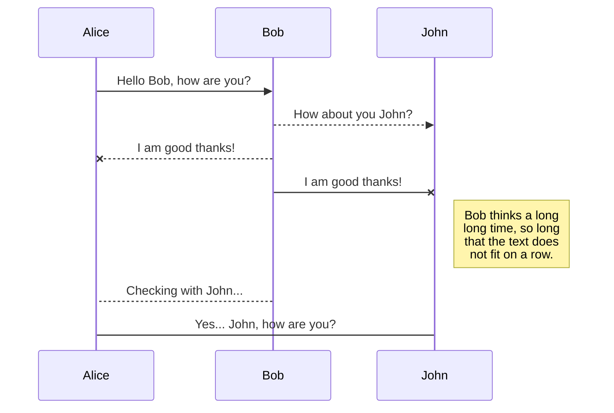

<<<<<<< HEAD

# How to Troubleshoot on Link HQ to DR site down

- When fiber link between site was down.
- When symphony node down
- When router down
  
## Diagram


## Configurations

### When need to switch to emergency route.

- Change configure in core switch at HQ

- Activate emergency route
- Deactivate emergency route
  
#### Activate emergency route

for nexus 192.168.0.151

```sh
GL-N5K-01# configure terminal
GL-N5K-01# no ip route 192.168.9.0/24 192.168.0.9
GL-N5K-01# ip route 192.168.9.0/24 192.168.0.252
```

for nexus 192.168.0.152

```sh
GL-N5K-02# configure terminal
GL-N5K-02# no ip route 192.168.9.0/24 192.168.0.9
GL-N5K-02# ip route 192.168.9.0/24 192.168.0.252
```

for fortigate DR as a router

```sh
config router static
edit 7
unset gateway 192.168.9.254
set device "DR-to-HQ"
end
```

#### Revert to normal  route

for nexus 192.168.0.151

```sh
GL-N5K-01# configure terminal
GL-N5K-01# no ip route 192.168.9.0/24 192.168.0.252
GL-N5K-01# ip route 192.168.9.0/24 192.168.0.9
```

for nexus 192.168.0.152

```sh
GL-N5K-02# configure terminal
GL-N5K-02# no ip route 192.168.9.0/24 192.168.0.252
GL-N5K-02# ip route 192.168.9.0/24 192.168.0.9
```

for fortigate DR as a router

```sh
config router static
edit 7
set gateway 192.168.9.254
set device "lan"
end
    
```

### Resource table

| Resource           | README                                    |
| ---------------- | ----------------------------------------- |
| Guide          | [Guide-to-create-site2site-tunnel][PlDb]         |


แถม
```mermaid
sequenceDiagram
Alice ->> Bob: Hello Bob, how are you?
Bob-->>John: How about you John?
Bob--x Alice: I am good thanks!
Bob-x John: I am good thanks!
Note right of John: Bob thinks a long<br/>long time, so long<br/>that the text does<br/>not fit on a row.

Bob-->Alice: Checking with John...
Alice->John: Yes... John, how are you?

   [dill]: <https://github.com/joemccann/dillinger>
   [git-repo-url]: <https://github.com/joemccann/dillinger.git>
   [john gruber]: <http://daringfireball.net>
   [df1]: <http://daringfireball.net/projects/markdown/>
   [markdown-it]: <https://github.com/markdown-it/markdown-it>
   [Ace Editor]: <http://ace.ajax.org>
   [node.js]: <http://nodejs.org>
   [Twitter Bootstrap]: <http://twitter.github.com/bootstrap/>
   [jQuery]: <http://jquery.com>
   [@tjholowaychuk]: <http://twitter.com/tjholowaychuk>
   [express]: <http://expressjs.com>
   [AngularJS]: <http://angularjs.org>
   [Gulp]: <http://gulpjs.com>

   [PlDb]: <https://weberblog.net/ipsec-site-to-site-vpn-palo-alto-fortigate/>
=======

# How to Troubleshoot on Link HQ to DR site down

- When fiber link between site was down.
- When symphony node down
- When router down
  
## Diagram


## Configurations

### When need to switch to emergency route.

- Change configure in core switch at HQ

- Activate emergency route
- Deactivate emergency route
  
#### Activate emergency route

for nexus 192.168.0.151

```sh
GL-N5K-01# configure terminal
GL-N5K-01# no ip route 192.168.9.0/24 192.168.0.9
GL-N5K-01# ip route 192.168.9.0/24 192.168.0.252
```

for nexus 192.168.0.152

```sh
GL-N5K-02# configure terminal
GL-N5K-02# no ip route 192.168.9.0/24 192.168.0.9
GL-N5K-02# ip route 192.168.9.0/24 192.168.0.252
```

for fortigate DR as a router

```sh
config router static
edit 7
unset gateway 192.168.9.254
set device "DR-to-HQ"
end
```

#### Revert to normal  route

for nexus 192.168.0.151

```sh
GL-N5K-01# configure terminal
GL-N5K-01# no ip route 192.168.9.0/24 192.168.0.252
GL-N5K-01# ip route 192.168.9.0/24 192.168.0.9
```

for nexus 192.168.0.152

```sh
GL-N5K-02# configure terminal
GL-N5K-02# no ip route 192.168.9.0/24 192.168.0.252
GL-N5K-02# ip route 192.168.9.0/24 192.168.0.9
```

for fortigate DR as a router

```sh
config router static
edit 7
set gateway 192.168.9.254
set device "lan"
end
    
```

### Resource table

| Resource           | README                                    |
| ---------------- | ----------------------------------------- |
| Guide          | [Guide-to-create-site2site-tunnel][PlDb]         |


แถม


   [dill]: <https://github.com/joemccann/dillinger>
   [git-repo-url]: <https://github.com/joemccann/dillinger.git>
   [john gruber]: <http://daringfireball.net>
   [df1]: <http://daringfireball.net/projects/markdown/>
   [markdown-it]: <https://github.com/markdown-it/markdown-it>
   [Ace Editor]: <http://ace.ajax.org>
   [node.js]: <http://nodejs.org>
   [Twitter Bootstrap]: <http://twitter.github.com/bootstrap/>
   [jQuery]: <http://jquery.com>
   [@tjholowaychuk]: <http://twitter.com/tjholowaychuk>
   [express]: <http://expressjs.com>
   [AngularJS]: <http://angularjs.org>
   [Gulp]: <http://gulpjs.com>

   [PlDb]: <https://weberblog.net/ipsec-site-to-site-vpn-palo-alto-fortigate/>
>>>>>>> 8bb4eeaee58533267303473dfbafda91be6a25d7
